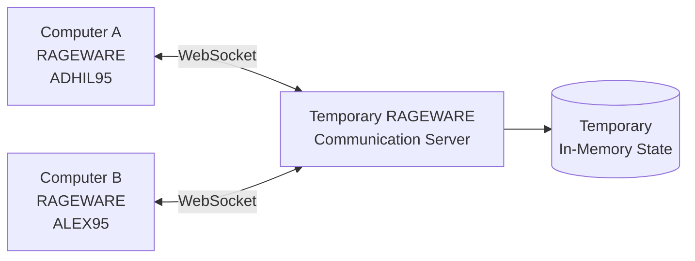

# RageWare OS 🎯


## Basic Details
### Team Name: AltF4


### Team Members
- Team Lead: Mohamed Arif J - [Jawaharlal college of engineering and technology]
- Member 2: Adhil V T - [Jawaharlal college of engineering and technology]

### Project Description
**RAGEWARE** is an interactive, browser-based simulation of a retro 1990s desktop operating system (styled after Windows 95 and Windows 98). Rather than presenting separate, disjointed mini-games, **the operating system itself serves as the interactive environment**. As the user performs common computing tasks—such as browsing files, typing commands, running system updates, or adjusting settings—the system actively monitors user behavior and becomes progressively uncooperative, sarcastic, and hostile. 
The application observes behavioral indicators (such as rapid clicking, repeated failed button clicks, attempts to close warning dialogs, and post-failure facial activity via an optional webcam sensor). It feeds these signals into a dynamic **Rage Engine**, which adapts interface friction to exploit the user's specific behavioral vulnerabilities. We added more useless applications like Caught In 4K, NOBROWSE™, NAAS, and Gesture Drive.

### The Problem (that doesn't exist)
Modern software engineering and HCI tries to make interfaces smooth, simple, and user-friendly.
RAGEWARE said: “No.”
Instead, it explores how an interface can detect when a user is slowly losing their patience through their actions—without cameras, biometrics, or mind reading.
An adaptive system identifies what annoys the user most, whether it's delays, dodging interactions, or annoying pop-ups, and adjusts accordingly.
Retro OS elements like error messages, progress bars, and modal dialogs are then used to create a carefully engineered amount of suffering.
The goal? Study human tolerance… one rage quit at a time.
Note: RAGEWARE is not a medical or psychiatric emotion detector. It simply knows when you've had enough.

### The Solution (that nobody asked for)

Modern software spends millions of dollars trying to make users happy.
RAGEWARE respectfully disagrees.
Instead of removing frustrating experiences, RAGEWARE studies them. The system observes how users interact with an application and estimates when their patience is slowly evaporating into the void.
Did the page take too long to load?
Did the user repeatedly click the same button?
Did they aggressively close another pop-up?
Did they start moving their mouse like they're trying to physically attack the operating system?
Perfect. We may have something.
RAGEWARE analyzes interaction patterns to identify what specifically annoys a user the most—delays, interruptions, unnecessary confirmations, disappearing buttons, suspiciously slow progress bars, or the timeless classic: an error message that explains absolutely nothing.
Then comes the innovation.
Instead of fixing the problem immediately, RAGEWARE adapts the experience to provide a scientifically engineered, carefully controlled amount of additional suffering.
Retro-inspired UI elements such as fake loading bars, cryptic error messages, unnecessary modal dialogs, and progress indicators that somehow move backwards can be dynamically introduced to test one important question:
How much nonsense can a human tolerate before closing the application with unnecessary force?
The system does not use cameras.
It does not read biometrics.
It does not read minds.
It simply watches your interaction patterns and thinks:
"Yeah... this person is one pop-up away from uninstalling everything."
RAGEWARE's goal is not to make software better.
At least, not immediately.
First, we need to understand exactly how much worse we can make it.
Because before we can build truly user-friendly interfaces, perhaps we should first discover the precise moment when a user whispers:
"That's it. I'm done."
And then clicks Exit.
One rage quit at a time.

## Technical Details
### Technologies/Components Used
For Software:

RageWare OS
[Languages used]
JavaScript (ES6+)
JSX
HTML5
CSS3
WebAssembly (WASM)
Python
[Frameworks used]
React.js
React DOM
[Libraries used]
@mediapipe/tasks-vision
Google MediaPipe Vision Models
Google Web Fonts
[Tools used]
Vite
@vitejs/plugin-react
Oxlint
Web Audio API
MediaDevices / getUserMedia API
Local Storage
Windows Custom Protocol Handler
Git
GitHub


NaaS — Nothing as a Service[live webapp Application in RageWare OS]

[Languages used]
JavaScript
HTML
CSS
[Frameworks used]
React.js
Express.js
Node.js
[Libraries used]
Axios
Mongoose
CORS
dotenv
[Tools used]
Vite
MongoDB Atlas
Render
Git
GitHub
npm
Nodemon

Caught in 4K [Live Web App Application in RageWare OS]
- **Live URL**: https://caught-in-4k-rho.vercel.app/
- **Description**: Real-time AI computer vision surveillance application running embedded inside an authentic retro window. Tracks facial reactions and emotion telemetry.

[Languages used]
Python (3.10+)
JavaScript (ES6+)
JSX
HTML5
CSS3

[Frameworks used]
React.js
FastAPI
PyTorch (CUDA / CPU acceleration)

[Libraries used]
Vision & NLP Models:
Moondream2 (vikhyatk/moondream2)
Qwen2.5-0.5B-Instruct (Qwen/Qwen2.5-0.5B-Instruct)
Sentence-Transformers (all-MiniLM-L6-v2)
Machine Learning & Core:
Hugging Face transformers
accelerate
einops
numpy

Backend Utilities:
uvicorn
Pillow (PIL - Python Imaging Library)
python-multipart
requests
pydantic
Frontend Packages:
react-webcam
axios

[Tools & Infrastructure used]
Vite
@vitejs/plugin-react
Modal (Serverless GPU Cloud Runtime)
Vercel Cloud
Git
GitHub
MediaDevices / getUserMedia API (Webcam optical frame buffer)
Canvas / Blob URL Object APIs
Windows 95/98 Design System (Authentic Retro OS styling)


NOBROWSE™ [Live Web App Application in RageWare OS]
- **Live URL**: https://nobrowser.vercel.app/
- **Description**: The distraction-free, unpredictable AI browser (40% useful, 60% questionable). Embedded directly inside an authentic retro chrome-less window.

[Languages used]
JavaScript (ES6+)
HTML5
CSS3

[Frameworks & Tools used]
Next.js / React
Vercel Cloud Deployment
Tailored Minimalist CSS Engine


Authentic 90s/2000s Media Gallery & Sound Vault [Native File System Feature]
- **Description**: Curated vintage hardware photography archive and 80s/90s Synthwave/Rock/Pop audio vault stored in the simulated in-memory filesystem (`virtualFs.js`).
- **Media Archives**:
  - *IBM PC 5150 Battlestation (1995)*: Vintage green CRT monitor with DOS prompt & mechanical keyboard.
  - *Floppy Disk Collection*: Authentic 8-inch, 5.25-inch, and 3.5-inch magnetic storage diskettes.
  - *Nintendo Game Boy (1989)*: Original Dot Matrix Game Boy console.
  - *Sony PlayStation (1995)*: Classic 32-bit PS1 CD console.
  - *Audio Tracks*: Rick Astley (1987), a-ha (1985), Harold Faltermeyer (1984), Nirvana (1991), Darude (1999), and Britney Spears (1998).


Implementation
For Software:

Installation
bash
# 1. Clone the repository
git clone https://github.com/your-username/rageware.git
# 2. Navigate to the project directory
cd rageware
# 3. Verify Node.js environment (v18.0.0 or higher recommended)
node -v
npm -v
# 4. Install dependencies cleanly
npm install


Run
bash
# Start the local development server
npm run dev
# (Optional) Run the linter to verify code quality
npm run lint
# (Optional) Build and preview the production bundle locally
npm run build
npm run preview


Project Documentation
For Software:

1. System Overview
RAGEWARE is an intentionally hostile, retro operating system simulation styled after Windows 95 and Windows 98. Designed as an interactive Human-Computer Interaction (HCI) research sandbox, the system deliberately reverses standard user-experience heuristics to study user tolerance thresholds, adaptive behavioral friction, and procedural interface antagonism.

The entire application runs 100% client-side inside the browser with zero backend server, database, or external cloud API requirements.

# Screenshots (Add at least 3)

Dashboard

booting


booting


desktop


NASS Application


optical sensor


Drive by gesture


other elements in the os like task manager, musics,videos ets


# Diagrams


### Project Demo
# Video
https://drive.google.com/file/d/1niHrqr2EnIt1GPrBrRRqXgPCinyKPLRD/view?usp=sharing


## Team Contributions
- [Mohamed Arif J]: [Builded The applications in the RagewareOS]
- [Adhil V T]: [Builded RageWare OS]

---

### Temporary Real-Time RAGEWARE Mail

RAGEWARE Mail is a simulated retro Windows 95/98 communication client allowing two users running RAGEWARE on different browsers or computers to exchange genuine, instant messages in real time.



#### Core Architecture & Features:
- **Temporary RAGEWARE ID**: Users pick a temporary session ID (e.g. `ADHIL95`, `ALEX95`). No password, no permanent profile, no registration.
- **Temporary Address**: Displayed as `ADHIL95@RAGEWARE` (simulated address within RAGEWARE, not a real public internet email).
- **Temporary Session / Room**: Users enter a shared 5-character session room code (e.g. `7K4P9`). Duplicate IDs within the same active room are automatically rejected.
- **Real-Time WebSocket Protocol**: Direct bidirectional peer delivery. When `ADHIL95` sends a message, `ALEX95` receives it immediately with zero page refresh.
- **Pure In-Memory State**: Zero database (no PostgreSQL, SQLite, MongoDB, Supabase, or Firebase). All active connections, rooms, and temporary message logs exist strictly in RAM during the active session. When users leave or the server restarts, all data disappears.
- **No Real Email**: Does not use or touch SMTP, IMAP, Gmail API, Outlook, SendGrid, or OAuth.
- **Vercel Frontend Compatibility**: The RAGEWARE frontend stays hosted on Vercel as a static client, connecting to the communication server via the configurable `VITE_RAGEWARE_REALTIME_URL` environment variable.
- **Retro Windows 95/98 Client**: Complete with classic folder navigation (`Inbox`, `Sent`, `Drafts`, `Trash`), reading pane, message composition dialog, reply threads (`Re: ...`), and online user presence.
- **OS Integration**: Real-time incoming mail displays the classic Windows 95 system tray balloon notification with an `[ OPEN ]` button. Clicking `[ OPEN ]` launches RAGEWARE Mail and highlights the incoming message.
- **Rage & Personality Synchronization**: Failed recipient lookups feed subtle friction into the `rageEngine`, while repeated refreshes, rapid send attempts, and delivery milestones trigger authentic `osPersonality` reactions.

#### Local Development:

**Terminal 1 — Start the Real-Time Communication Server:**
```bash
npm run server
# Starts WebSocket server on ws://localhost:8000
```

**Terminal 2 — Start RAGEWARE Frontend:**
```bash
npm run dev
# Starts Vite dev server on http://localhost:5173
```

#### Two-User Demonstration Flow:
1. Open **Browser 1** (e.g., Chrome):
   - Navigate to RAGEWARE OS -> Open **RAGEWARE Mail**.
   - Enter ID: `ADHIL95`.
   - Select **Create New Session** (note the 5-character code, e.g. `7K4P9`).
   - Click **Enter RAGEWARE Mail**.
2. Open **Browser 2** (e.g., Chrome Incognito or Edge):
   - Navigate to RAGEWARE OS -> Open **RAGEWARE Mail**.
   - Enter ID: `ALEX95`.
   - Select **Join Existing Session** and enter `7K4P9`.
   - Click **Enter RAGEWARE Mail**.
3. **Send & Reply**:
   - Both users will see each other in the `ONLINE USERS` list.
   - `ADHIL95` clicks **New Msg**, enters `ALEX95@RAGEWARE`, Subject: `Lab Meeting`, Body: `Are you coming to the lab?`, and clicks **SEND**.
   - `ALEX95` immediately receives a system tray notification (`NEW MAIL From: ADHIL95@RAGEWARE [ OPEN ]`) and the email lands in the Inbox.
   - `ALEX95` clicks **Reply**, writes `Yes, I'll be there.`, and sends. `ADHIL95` receives the reply immediately.

---
Made with ❤️ at TinkerHub Useless Projects 


