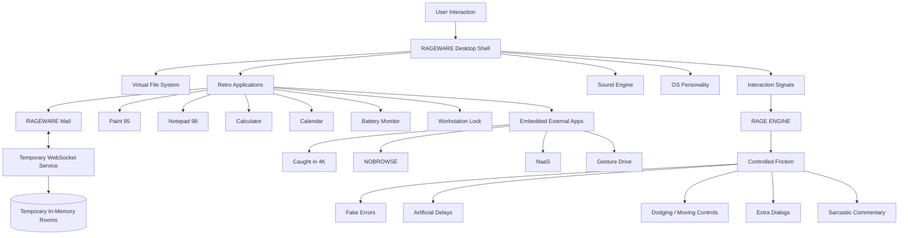
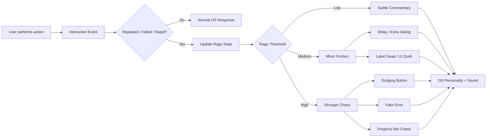
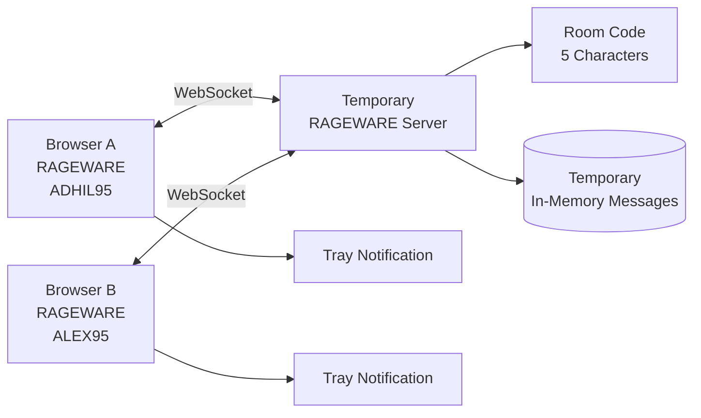
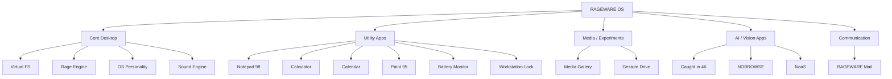

# RAGEWARE OS 🎯

## Basic Details

### Team Name: AltF4

### Team Members
- Team Lead: Mohamed Arif J - Jawaharlal College of Engineering and Technology
- Member 2: Adhil V T - Jawaharlal College of Engineering and Technology

### Project Description
**RAGEWARE OS** is an interactive browser-based simulation of a retro 1990s desktop operating system inspired by Windows 95/98. The operating system itself is the playground: users browse files, open applications, type commands, change settings, and interact with deliberately inconvenient system behaviour.

A dynamic **Rage Engine** observes interaction patterns such as rapid clicking, repeated failed actions, dismissals, and other visible UI interactions, then introduces controlled interface friction. The OS also contains intentionally useless applications such as RAGEWARE Mail, NOBROWSE™, NaaS, Caught in 4K, Gesture Drive, Paint 95, and more.

### The Problem (that doesn't exist)
Modern software engineering and HCI usually focuses on reducing friction and making interfaces easier to use.

RAGEWARE explores the exact opposite direction: what happens when a user interface deliberately notices repeated interaction patterns and responds with increasingly inconvenient behaviour?

The project turns common interface elements—error dialogs, loading bars, confirmation boxes, buttons, notifications, and settings—into experimental HCI components. The aim is to explore user tolerance and interaction behaviour in a playful, controlled environment.

### The Solution (that nobody asked for)
RAGEWARE creates a complete retro desktop environment where frustration is treated as a system interaction signal rather than simply a failure.

The OS can react to repeated clicks, failed actions, repeated dismissals, delays, and application-specific events. The **Rage Engine** converts these signals into controlled UI changes such as fake errors, delayed actions, moving controls, unnecessary confirmations, sarcastic messages, and other retro-style chaos.

The result is a self-contained HCI sandbox where the user can experience and observe adaptive interface friction without modifying the host operating system.

> **Important:** RAGEWARE is an experimental interface simulation, not a medical, psychiatric, or diagnostic emotion detector. The core Rage Engine works from observable interaction patterns.

## Technical Details

### Technologies/Components Used

For Software:

**Languages**
- JavaScript (ES6+)
- JSX
- HTML5
- CSS3
- Python 3.10+
- WebAssembly (WASM)

**Frameworks**
- React.js
- React DOM
- Next.js
- Express.js
- FastAPI

**Libraries / Models**
- @mediapipe/tasks-vision
- Google MediaPipe Vision Models
- PyTorch
- Hugging Face Transformers
- Moondream2
- Qwen2.5-0.5B-Instruct
- Sentence-Transformers / all-MiniLM-L6-v2
- Axios
- Mongoose
- CORS
- dotenv
- NumPy
- Pillow
- Uvicorn
- Pydantic
- python-multipart
- react-webcam
- accelerate
- einops

**Browser APIs**
- Web Audio API
- MediaDevices / getUserMedia
- Canvas / Blob URL APIs
- Local Storage
- Native Date API

**Tools & Infrastructure**
- Vite
- @vitejs/plugin-react
- Oxlint
- Node.js
- npm
- Git
- GitHub
- MongoDB Atlas
- Render
- Modal Serverless GPU Cloud Runtime
- Vercel

For Hardware:

- No dedicated hardware is required.
- Modern Chromium-based browser recommended.
- Keyboard and mouse for the main OS.
- Optional webcam for the separate Caught in 4K experience.

### Implementation

For Software:

#### Installation

```bash
# 1. Clone the repository
git clone https://github.com/Mohamed-Arif-J/RageWare_OS.git

# 2. Navigate to the project
cd RageWare_OS

# 3. Check the environment
node -v
npm -v

# 4. Install dependencies
npm install
```

#### Run

```bash
# Start the RAGEWARE development server
npm run dev

# Optional: check code quality
npm run lint

# Optional: build for production
npm run build

# Optional: preview the production build
npm run preview
```

#### RAGEWARE Mail Development

RAGEWARE Mail can use a temporary WebSocket server for two-user real-time communication.

Terminal 1:
```bash
npm run server
# WebSocket server: ws://localhost:8000
```

Terminal 2:
```bash
npm run dev
# Frontend: http://localhost:5173
```

### Project Documentation

For Software:

#### 1. System Overview

RAGEWARE is an intentionally hostile retro operating-system simulation. The browser provides the desktop environment, while modular applications, a virtual filesystem, sound services, personality reactions, and the Rage Engine work together to create the experience.

The core desktop is browser-contained and does not control the host operating system. Individual integrated applications may use their own backend or cloud service where required.

#### 2. Core Applications

**RAGEWARE Mail**
- Windows 95/98-style inbox, sent, drafts, and trash
- Temporary RAGEWARE IDs and session rooms
- Real-time WebSocket messaging
- Message threading and reply support
- System-tray incoming-mail notifications
- Temporary in-memory state; no SMTP/IMAP or real email account

**Notepad 98 AI Edition**
- Retro text editor with line, column, and word counts
- Virtual filesystem integration
- Safe Mode and Chaos Mode
- Deliberately chaotic text transformations and keyboard behaviour

**Calculator**
- Classic arithmetic operations
- Square root, reciprocal, percentage, sign toggle
- Chained calculations and history
- Overflow and division-by-zero protection
- Rage-based UI chaos such as label swaps and evasive controls

**Calendar & Schedule**
- Gregorian calendar
- Month/year navigation
- Leap-year and weekday calculations
- Live clock
- Fictional appointments and interaction-based commentary

**Paint 95**
- Pencil, brush, eraser, airbrush, bucket, line, curve, shapes, text, eyedropper, and zoom
- 28-colour palette
- 25-step undo/redo
- PNG/BMP export
- HTML5 Canvas with dual-canvas architecture
- BFS flood fill and ImageData operations
- Optional AI art critic and chaos effects

**Battery Status Monitor**
- Simulated battery percentage and voltage
- AC indicators and segmented power meter
- CRT scanline overlay
- Connect AC Adapter, Safe Mode reboot, and Pray actions
- Deliberately fake low-battery events and blackout effects

**System Workstation Lock**
- Simulated Windows NT/95 lock screen
- Registered owner and machine name
- Password challenge
- Browser-safe full-screen overlay
- Fake unlock rejection, delays, and moving controls

**Caught in 4K**
- AI computer-vision application embedded inside a RAGEWARE window
- React + FastAPI + PyTorch based architecture
- Moondream2, Qwen2.5-0.5B-Instruct, Sentence-Transformers and Hugging Face components
- Optional webcam interaction through MediaDevices / react-webcam
- GPU inference infrastructure through Modal and deployment through Vercel
- Live URL: https://caught-in-4k-rho.vercel.app/

**NOBROWSE™**
- Chrome-less unpredictable AI browser
- Next.js / React implementation
- Retro OS embedding
- Live URL: https://nobrowser.vercel.app/

**NaaS — Nothing as a Service**
- Live web application embedded inside RAGEWARE
- React, Express, Node.js, Axios, Mongoose, CORS and dotenv
- MongoDB Atlas backend
- Render deployment

**Retro Media Gallery & Sound Vault**
- Simulated media archive through `virtualFs.js`
- IBM PC 5150, floppy disks, Nintendo Game Boy and Sony PlayStation references
- Retro audio collection and sound effects
- Integrated with the simulated desktop environment

**Gesture Drive & Optical Sensor**
- Gesture-based interaction experiments
- Optical/computer-vision interface components
- Designed as additional interactive experiments inside the OS

#### 3. Rage Engine

The Rage Engine is the central interaction layer that turns observable UI behaviour into controlled chaos.

Typical signals include:
- Rapid repeated clicks
- Repeated failed actions
- Repeated dismissals
- Refresh/send attempts
- Application-specific interaction events
- Timing and repetition patterns

Possible responses include:
- Fake error dialogs
- Artificial delays
- Moving or dodging buttons
- Unnecessary confirmation dialogs
- Sarcastic system messages
- Fake loading/progress behaviour
- Random UI quirks
- Sound and personality reactions

The goal is not to diagnose a user's emotional state. It is to demonstrate how an interface can adapt to interaction behaviour.

#### 4. RAGEWARE Mail

RAGEWARE Mail provides temporary two-user communication inside the retro OS.

- Users choose temporary IDs such as `ADHIL95` and `ALEX95`.
- A shared five-character room code connects users.
- Messages are delivered through WebSocket communication.
- Active rooms and messages are kept in temporary in-memory state.
- There is no real email account, SMTP, IMAP, Gmail API, Outlook API, or OAuth integration.
- The frontend can remain hosted separately while the real-time service is configured through `VITE_RAGEWARE_REALTIME_URL`.

### Project Documentation — Screenshots

# Screenshots (Add at least 3)


*RAGEWARE desktop dashboard showing the main retro operating-system environment.*


*Retro boot screen introducing the simulated operating system.*


*Boot-stage interface and system initialization experience.*


*Windows 95/98-inspired desktop with applications and system controls.*


*NaaS running as an embedded web application inside RAGEWARE.*


*Optical/computer-vision interaction experience.*


*Gesture Drive experiment integrated into the OS.*


*Additional RAGEWARE OS elements and applications.*

# Diagrams

### 1. RAGEWARE OS Architecture



*High-level architecture showing the desktop shell, applications, interaction signals, Rage Engine, and optional integrated services.*

### 2. Rage Engine Interaction Flow



*Interaction signals are converted into progressively stronger but controlled interface effects.*

### 3. RAGEWARE Mail Real-Time Architecture



*Temporary two-user communication flow. No permanent mailbox or external email provider is required.*

### 4. RAGEWARE Application Map



*Application map showing how the major RAGEWARE components are grouped inside the simulated operating system.*

### Project Demo

# Video

https://drive.google.com/file/d/1niHrqr2EnIt1GPrBrRRqXgPCinyKPLRD/view?usp=sharing

*The demo demonstrates the RAGEWARE OS environment, retro applications, adaptive chaos, and integrated experiences.*

# Additional Demos

- **Caught in 4K:** https://caught-in-4k-rho.vercel.app/
- **NOBROWSE™:** https://nobrowser.vercel.app/

## Team Contributions

- **Mohamed Arif J:** Built the applications and integrated the major interactive experiences inside RAGEWARE OS, including application logic, UI behaviour, and supporting integrations.
- **Adhil V T:** Built the core RAGEWARE OS desktop environment and integrated the operating-system-level experience.

---

Made with ❤️ at TinkerHub Useless Projects


